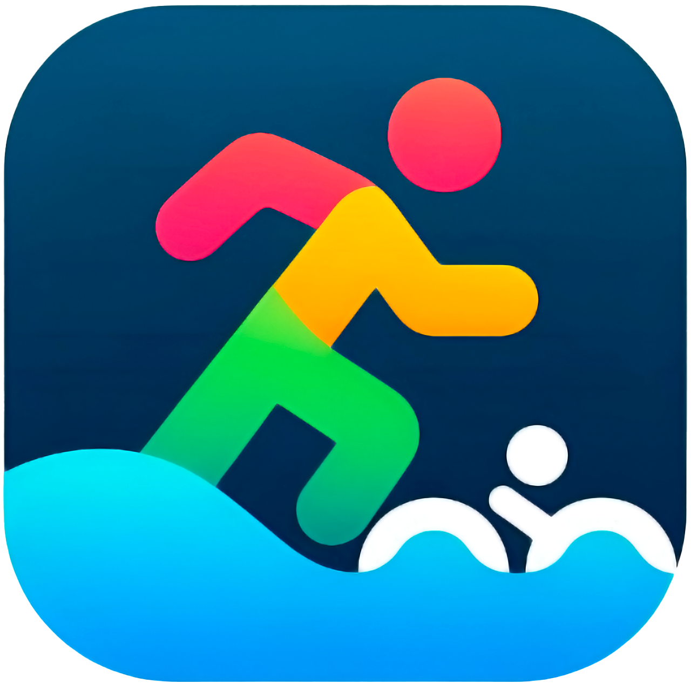
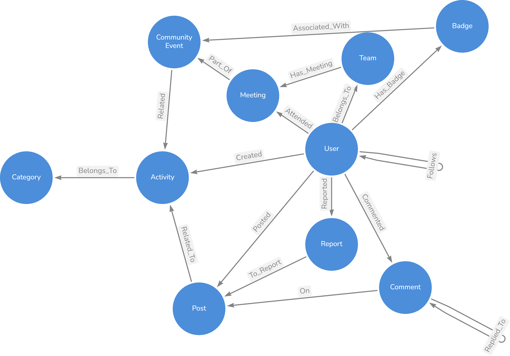
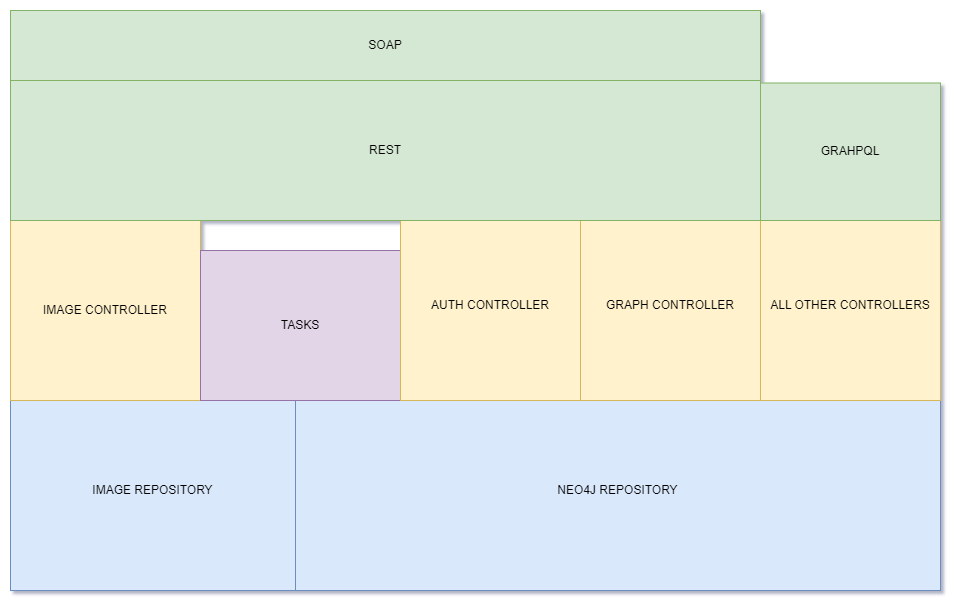
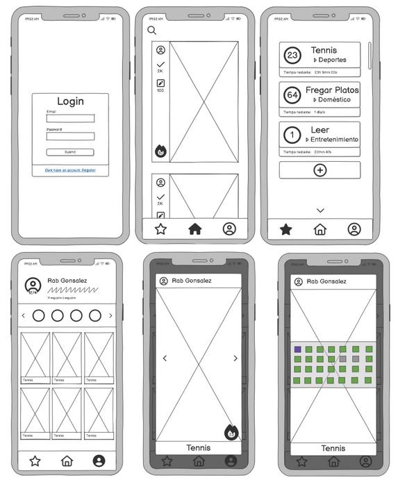
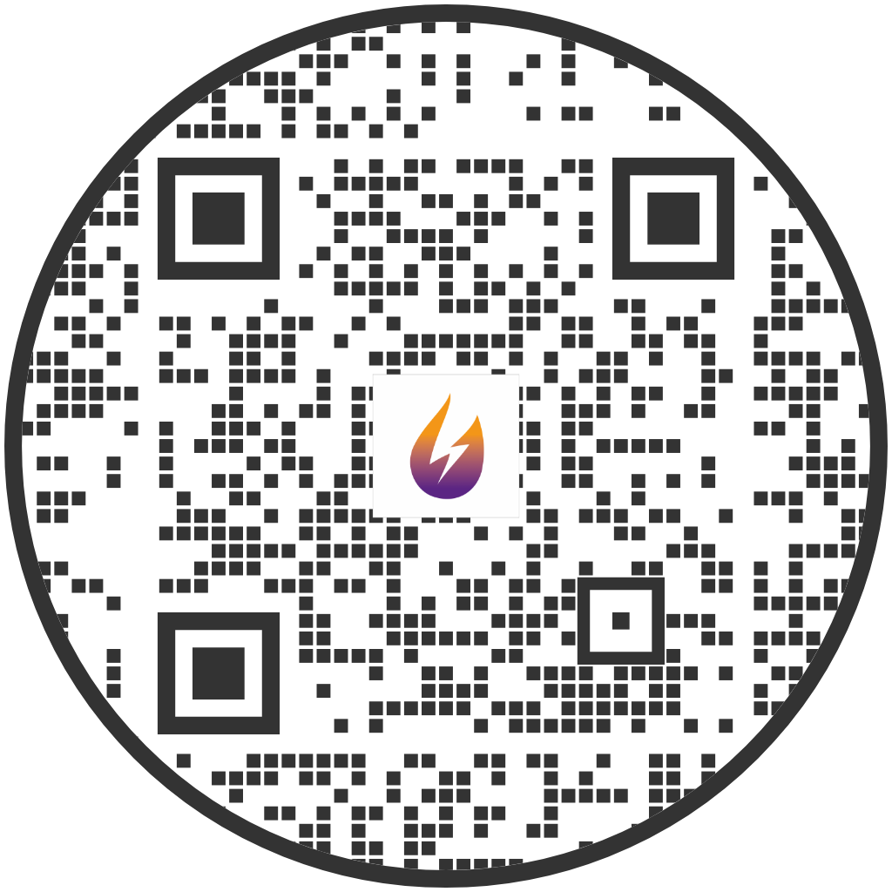

<div align="center">
    <h1>Routine-Fights</h1>
    <h2>Jonay Contreras Rodríguez & Rubén Abreu González</h2>
    
</div>

# Index

- [Index](#index)
- [Introduction](#introduction)
- [Tools](#tools)
- [Usage](#usage)
  - [Using Docker](#using-docker)
  - [Without Docker](#without-docker)
    - [Clone Repository](#clone-repository)
    - [Setup your Neo4j](#setup-your-neo4j)
    - [Start App](#start-app)
    - [Start Administration Page](#start-administration-page)
- [Endpoints Usage](#endpoints-usage)
  - [GraphQL](#graphql)
    - [Queries](#queries)
    - [Mutations](#mutations)
  - [REST](#rest)
    - [AUTH](#auth)
    - [IMAGES](#images)
    - [GRAPH](#graph)
  - [SOAP](#soap)
    - [AuthService](#authservice)
    - [GraphService](#graphservice)
    - [ImageService](#imageservice)
- [Marketing Plan](#marketing-plan)
  - [Market Analysis](#market-analysis)
    - [Ideal Customer Profile](#ideal-customer-profile)
    - [Competitor Analysis](#competitor-analysis)
    - [Market Trends](#market-trends)
  - [Value Proposition](#value-proposition)
  - [Promotion and Advertising Strategies](#promotion-and-advertising-strategies)
    - [Digital Marketing](#digital-marketing)
    - [Paid Advertising](#paid-advertising)
    - [Partnerships and Networking](#partnerships-and-networking)
  - [Sales and Pricing Strategy](#sales-and-pricing-strategy)
  - [Metrics and KPIs](#metrics-and-kpis)
- [Sustainability Plan](#sustainability-plan)
  - [Economic Sustainability](#economic-sustainability)
    - [Stable and Profitable Business Model](#stable-and-profitable-business-model)
    - [Efficient Financial Management](#efficient-financial-management)
  - [Social Sustainability](#social-sustainability)
    - [Digital Accessibility](#digital-accessibility)
    - [Business Ethics](#business-ethics)
    - [Education and Training](#education-and-training)
  - [Environmental Sustainability](#environmental-sustainability)
    - [Server Optimization](#server-optimization)
    - [Eco-friendly Web Design](#eco-friendly-web-design)
    - [Paperless Operations](#paperless-operations)
- [Diagrams](#diagrams)
- [Design](#design)
  - [Mockup](#mockup)
  - [Prototipe](#prototipe)
- [Sonarqube](#sonarqube)
- [Download The App](#download-the-app)

# Introduction

**Routine Fights** is a productivity-focused social media platform designed to help users enhance their habits, acquire new skills, and engage more consistently in doing routines.

# Tools

| **Database**                                                                            | **API**                                                              | **CI/CD**                                                                   | **FrontEnd APP**                                                                                          | **FrontEnd Administration**                                                                                                                                                                   |
| --------------------------------------------------------------------------------------- | -------------------------------------------------------------------- | --------------------------------------------------------------------------- | --------------------------------------------------------------------------------------------------------- | --------------------------------------------------------------------------------------------------------------------------------------------------------------------------------------------- |
| Neo4J                                                                                   | Spring                                                               | Github Actions                                                              | React Native                                                                                              | React                                                                                                                                                                                         |
|  |  |  |  |  |

# Usage

## Using Docker

## Without Docker

Execute this docker-compose

```yaml
version: '3.3'

services:
  app:
    image: jonaykb/apiroutinefights:latest
    container_name: apiroutinefights
    restart: always
    ports:
      - "8080:8080"
    environment:
      - SPRING_NEO4J_URI=bolt://db:7687
      - SPRING_AUTHENTICATION_NEO4J_USER=neo4j
      - SPRING_AUTHENTICATION_NEO4J_PASSWORD=1q2w3e4r
      - MAIL_FROM=CHANGE_THIS@EMAIL.com
      - MAIL_PASSWORD=YOUR_TOKEN
      - SERVER_SSL_ENABLED=false
      - JWT_SECRET=SECRET
    depends_on:
      - db
    networks:
      - apiNetwork
    volumes:
      - app_uploads:/uploads
  db:
    image: neo4j:latest
    volumes:
        - /$HOME/neo4j/logs:/logs
        - /$HOME/neo4j/config:/config
        - /$HOME/neo4j/data:/data
        - /$HOME/neo4j/plugins:/plugins
    environment:
        - NEO4J_AUTH=neo4j/1q2w3e4r
    restart: always
    networks:
      - apiNetwork

volumes:
  db_data:
  app_uploads:
networks:
  apiNetwork:
```

### Clone Repository

```bash
git clone https://github.com/JonayKB/Routine-Fights/
```

### Setup your Neo4j

Setup your Neo4J or by the client.

Then add the username, url and password on application.properties

### Start App

```bash
mvn clean spring-boot:run
```

### Start Administration Page

```bash
npm i
npm build
serve build/
```

# Endpoints Usage

## GraphQL

### Queries

| Query                                                            | Description                                                                             |
| ---------------------------------------------------------------- | --------------------------------------------------------------------------------------- |
| `getUserPaginationByName(page, perPage, userName)`               | Returns a paginated list of users whose username matches the filter.                    |
| `getUserV2(email)`                                               | Fetches a single user by email.                                                         |
| `getUserV2IsFollowing(email)`                                    | Fetches a single user by email and includes whether the current user is following them. |
| `followersByEmail(email, usernameFilter)`                        | Lists followers of a user, filtered by follower username.                               |
| `followedByEmail(email, usernameFilter)`                         | Lists users that the given email is following, filtered by username.                    |
| `images`                                                         | Returns a list of image URLs (e.g. for a gallery or assets).                            |
| `postsV2(lastDate, limit)`                                       | Retrieves recent posts before `lastDate`, up to `limit`.                                |
| `postsByUserV2(userID, lastDate, limit)`                         | Retrieves a user’s posts before `lastDate`, up to `limit`.                              |
| `postsByActivityV2(activityID, lastDate, limit)`                 | Retrieves posts for a given activity before `lastDate`, up to `limit`.                  |
| `postsFollowingV2(lastDate, limit)`                              | Retrieves posts from users the current user follows.                                    |
| `postsSubscribedActivitiesV2(lastDate, limit)`                   | Retrieves posts from activities the user is subscribed to.                              |
| `paginationActivitiesNotSubscribed(page, perPage, activityName)` | Paginates activities the user is *not* subscribed to, optionally filtered by name.      |
| `getOwnUser`                                                     | Returns the currently authenticated user.                                               |
| `getSubscribedActivitiesWithStreakByName(activityName)`          | Lists subscribed activities matching the name and includes current streak info.         |
| `getComments(postID)`                                            | Fetches all comments for a given post.                                                  |
| `getCommunityEventById(id)`                                      | Fetches detailed info for one community event (v3).                                     |
| `getUsersParticipatingInCommunityEvent(id)`                      | Lists users participating in a specified community event.                               |
| `getActiveCommunityEvents`                                       | Lists all currently active community events (v2).                                       |
| `getNearestCommunityEvent`                                       | Retrieves the geographically or temporally nearest community event.                     |
| `getCommunityEventPointsById(id)`                                | Returns the total points accumulated for an event by the current user.                  |
| `getBadgesByEmail(email)`                                        | Lists all badges earned by a specified user (v2).                                       |
| `getOwnBadges`                                                   | Lists badges earned by the current user (v2).                                           |
| `findBadgeById(id)`                                              | Fetches a badge by its ID (v3), including event details.                                |
| `findBadgeByCommunityEvent(communityEventId)`                    | Lists all badges associated with a given community event.                               |

### Mutations

| Mutation                                      | Description                                                                                               |
| --------------------------------------------- | --------------------------------------------------------------------------------------------------------- |
| `saveUserV3(user)`                            | Creates a new user (v3) or returns existing if `id` provided.                                             |
| `updateUserV3(user)`                          | Updates all fields of an existing user (v3).                                                              |
| `deleteUserV3(id)`                            | Soft‐deletes a user (v3).                                                                                 |
| `restoreUserV3(id)`                           | Restores a previously deleted user (v3).                                                                  |
| `updateUserV2(user)`                          | Updates an existing user (v2) by ID.                                                                      |
| `deleteUserV2(id)`                            | Deletes a user (v2) by ID.                                                                                |
| `likePost(postID)`                            | Adds a “like” to the specified post.                                                                      |
| `unLikePost(postID)`                          | Removes the authenticated user’s like from the post.                                                      |
| `followUser(followingEmail)`                  | Authenticated user follows another user by email.                                                         |
| `unfollowUser(followingEmail)`                | Authenticated user unfollows another user.                                                                |
| `subscribeActivity(activityID)`               | Subscribes the authenticated user to an activity.                                                         |
| `unSubscribeActivity(activityID)`             | Unsubscribes the authenticated user from an activity.                                                     |
| `uploadPost(image, activityID)`               | Creates a new post with an image under a specific activity.                                               |
| `createActivity(activityInput)`               | Creates a new activity with metadata (name, description, image, time rate, required times).               |
| `postComment(commentInput)`                   | Posts a new comment or reply under a post.                                                                |
| `createCommunityEvent(...)`                   | Creates a new community event (v3) with name, requirements, date range, image, and associated activities. |
| `createBadge(image, level, communityEventId)` | Creates a new badge tied to a community event (v3).                                                       |
| `addBadgeToUser(userEmail, badgeId)`          | Awards a badge to a single user.                                                                          |
| `addBadgeToUsers(userEmail[], badgeId)`       | Awards a badge to multiple users, returning an array of success flags.                                    |

## REST

### AUTH

| Method | Path                           | Parameters                                                                    | Request Body (JSON)                                                                                                                          | Description                                 |
| ------ | ------------------------------ | ----------------------------------------------------------------------------- | -------------------------------------------------------------------------------------------------------------------------------------------- | ------------------------------------------- |
| POST   | `/auth/register`               | —                                                                             | <code>{"username": "string","email": "string","password": "string","nationality": "string","phoneNumber": "string","image": "string"}</code> | Create a new user account.                  |
| POST   | `/auth/login`                  | **email** (query, string, required)<br>**password** (query, string, required) | —                                                                                                                                            | Authenticate a user and return a JWT token. |
| GET    | `/auth/verify/{email}/{token}` | **email** (path, string, required)<br>**token** (path, string, required)      | —                                                                                                                                            | Verify user’s email with a token.           |

---

### IMAGES

| Method | Path                  | Parameters                             | Request Body (multipart/form-data) | Description                    |
| ------ | --------------------- | -------------------------------------- | ---------------------------------- | ------------------------------ |
| POST   | `/images/`            | —                                      | **file** (binary, required)        | Upload an image file.          |
| GET    | `/images/{imageName}` | **imageName** (path, string, required) | —                                  | Retrieve an image by filename. |

---

### GRAPH

*All `/graphs` endpoints return JSON chart‑data objects.*

| Method | Path                          | Parameters | Request Body | Description                                     |
| ------ | ----------------------------- | ---------- | ------------ | ----------------------------------------------- |
| GET    | `/graphs/users/points`        | —          | —            | Total points per user (for leaderboard charts). |
| GET    | `/graphs/users/creation`      | —          | —            | User sign‑up counts over time.                  |
| GET    | `/graphs/posts/points`        | —          | —            | Points or likes per post over time.             |
| GET    | `/graphs/posts/creation`      | —          | —            | Post creation counts over time.                 |
| GET    | `/graphs/activities/timerate` | —          | —            | Activity duration/frequency statistics.         |

---

## SOAP

### AuthService

| Operation  | SOAP Action | Input                 | Output                        | Description                                     |
| ---------- | ----------- | --------------------- | ----------------------------- | ----------------------------------------------- |
| `login`    | (none)      | `<login>` XML body    | `<loginResponse>` XML body    | Authenticate user and return token or response. |
| `register` | (none)      | `<register>` XML body | `<registerResponse>` XML body | Register a new user.                            |
| `verify`   | (none)      | `<verify>` XML body   | `<verifyResponse>` XML body   | Verify user’s email and token.                  |

### GraphService

| Operation              | SOAP Action | Input                             | Output                           | Description                            |
| ---------------------- | ----------- | --------------------------------- | -------------------------------- | -------------------------------------- |
| `getPostPointsChart`   | (none)      | `<getPostPointsChart>` XML body   | `<getPostPointsChartResponse>`   | Get chart data for post points.        |
| `getPostCreationChart` | (none)      | `<getPostCreationChart>` XML body | `<getPostCreationChartResponse>` | Get chart data for post creation.      |
| `getUserCreationChart` | (none)      | `<getUserCreationChart>` XML body | `<getUserCreationChartResponse>` | Get chart data for user registrations. |
| `getUserPointsChart`   | (none)      | `<getUserPointsChart>` XML body   | `<getUserPointsChartResponse>`   | Get chart data for user points.        |

### ImageService

| Operation    | SOAP Action | Input                   | Output                          | Description                   |
| ------------ | ----------- | ----------------------- | ------------------------------- | ----------------------------- |
| `getImage`   | (none)      | `<getImage>` XML body   | `<getImageResponse>` XML body   | Retrieve image by name or ID. |
| `uploadFile` | (none)      | `<uploadFile>` XML body | `<uploadFileResponse>` XML body | Upload an image file.         |

# Marketing Plan

## Market Analysis

### Ideal Customer Profile

The ideal customer for **Routine Fights** is someone committed to personal growth and constantly looking for ways to optimize their time and productivity.

With Routine Fights, these users can:

- Create personalized challenges and routines.
- Be part of a collaborative and motivational community.

This customer sees the app as a tool to transform their daily life and achieve a balance between personal discipline and community support.

---

### Competitor Analysis

Routine Fights competes with well-established applications that have large user bases, which can make it challenging to attract new users. However:

- Many apps focus on very specific niches (languages, workout routines, etc.).
- Routine Fights offers a **broader range of activities and customization**.
- It stands out for being **free**, with an optional premium plan.
- It promotes community engagement and exploration of new hobbies.

---

### Market Trends

- **Gamification** is booming (e.g., Duolingo).
- Mobile apps are increasingly popular due to their **convenience and accessibility**.

---

## Value Proposition

- Interface adapted for **left-handed and right-handed** users.
- **Free**, with optional subscription (cosmetics and temporary boosts).
- **Fast and intuitive** interface from the very first use.

---

## Promotion and Advertising Strategies

### Digital Marketing

Social media campaign featuring promotional videos that highlight:

- The app's flexibility.
- The importance of teamwork.

### Paid Advertising

- Initial investment in **Google Ads** to boost visibility and build a solid user base.

### Partnerships and Networking

- Collaborations with **influencers and content creators** to reach a minimum active community.

---

## Sales and Pricing Strategy

- **100% free** app.

- **Premium plan**: €5/month

  - No ads.
  - Extended streaks.
  - Access to global leaderboard with rewards.

- **Microtransactions**:

  - Remove individual ads.
  - Buy cosmetic items (do not affect scoring).

---

## Metrics and KPIs

- **Conversions (visits to customers)**: Measures how many users perform key actions (e.g., sign up, subscribe, purchase).
- **Social media engagement**: Likes, comments, shares, and views.
- **Advertising ROI**: Compares revenue against advertising spend.
- **Customer and sales growth**: Tracks growth in user base and revenue over time.

---

# Sustainability Plan

## Economic Sustainability

### Stable and Profitable Business Model

- Revenue from: web maintenance, hosting, and custom development.

### Efficient Financial Management

- Use of **Dolibarr** and financial specialists.
- All profits reinvested in the team and platform.

---

## Social Sustainability

### Digital Accessibility

- **Dark mode**.
- Interface for left-handed/right-handed users.
- Inclusive and varied activities.

### Business Ethics

- Fair and inclusive treatment.
- Efficient customer support.
- Community building and collaboration.

### Education and Training

- Initial training programs for new employees.
- Benefits:

  - Increased productivity.
  - Skill development.
  - Talent retention.

> Companies that train staff achieve up to 50% higher retention and 200% more revenue per employee compared to those that don't.

---

## Environmental Sustainability

### Server Optimization

- Use of **shared vCPUs** to optimize resources and reduce energy consumption.

### Eco-friendly Web Design

- **GraphQL** implementation to reduce unnecessary data and improve performance.

### Paperless Operations

- **100% digital operations**, minimizing waste and long-term costs.

# Diagrams

- **Entity-Relation Diagram**

<div align="center">

</div>

---

- **Database Diagram**

<div align="center">

</div>

- **Structure Diagram**
<div align="center">

</div>

# Design

## Mockup

<div align="center">

</div>

## Prototipe

[View the prototipe](https://www.figma.com/design/BVJR5gDZpDNDa25OzD5j3a/RoutineFights-DEMO?node-id=0-1&p=f)

# Sonarqube

[Look the quality of code and how it upgraded](http://zombiesurvive.ddns.net:9000)
> Ask to us to get the credentials

# Download The App

<div align="center">

</div>
